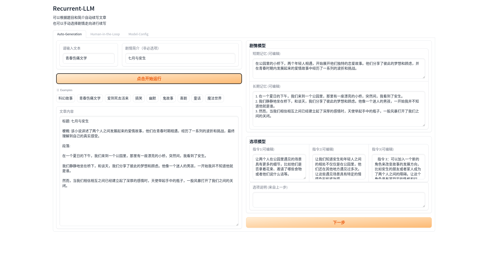

# Recurrent-LLM
The Open Source LLM implementation of paper: RecurrentGPT: Interactive Generation of (Arbitrarily) Long Text

## Global Config
[global_config.py](./global_config.py)

```
lang_opt = "zh" #  zh or en. make English or Chinese Novel
llm_model_opt = "openai" # default is openai, it also can be other open-source LLMs as below
```

### Supported LLM options

- [x] vicuna
- [x] chatglm
- [x] baichuan
- [x] aquila
- [x] falcon 

## OpenAI - ChatGPT

you should apply an openai api key first. then
```
export OPENAI_API_KEY = "your key"
```

## Vicuna 

download vicuna model. and config it in [models/vicuna_bin.py](models/vicuna_bin.py)

## ChatGLM

```python
tokenizer = AutoTokenizer.from_pretrained(model_name_or_path,trust_remote_code=True)
model_config = AutoConfig.from_pretrained(model_name_or_path, trust_remote_code=True)
model = AutoModel.from_pretrained(model_name_or_path, config=model_config, trust_remote_code=True)
```

## Baichuan

```python
tokenizer = AutoTokenizer.from_pretrained("baichuan-inc/baichuan-7B", trust_remote_code=True)
model = AutoModelForCausalLM.from_pretrained("baichuan-inc/baichuan-7B", device_map="auto", trust_remote_code=True)
```

## Aquila

```python
loader = AutoLoader(
        "lm",
        model_dir=state_dict,
        model_name=model_name,
        use_cache=True,
        fp16=True)
model = loader.get_model()
tokenizer = loader.get_tokenizer()
model.eval()
```
If want to use bminf, then add code as below:
```python
with torch.cuda.device(0):
    model = bminf.wrapper(model, quantization=False, memory_limit=2 << 30)
```

## WebUI

